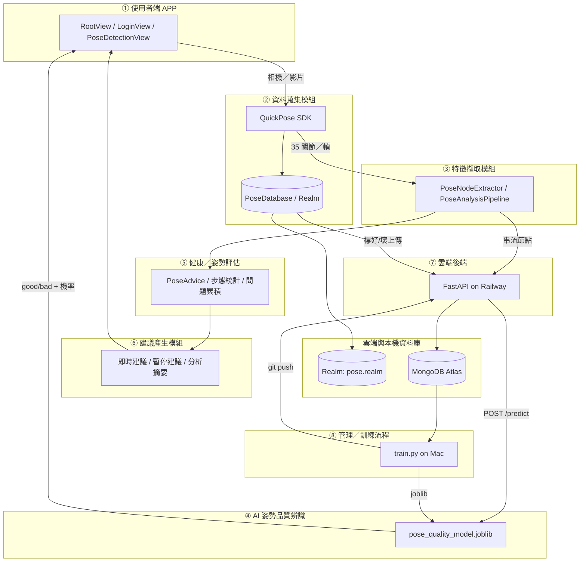
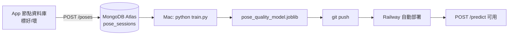

# Pose 姿勢偵測 APP — 系統架構（8 大類）

本文件依照系統架構圖，將專案拆分為 **8 大功能模組**，並標示對應的原始碼與資料流。

```
┌─────────────────────────────────────────────────────────────────────────────┐
│                        Pose 姿勢偵測 APP 系統架構                              │
├─────────────────────────────────────────────────────────────────────────────┤
│  ① 使用者端 APP          ② 資料蒐集          ③ 特徵擷取                      │
│  (iOS / SwiftUI)        (QuickPose SDK)     (關節 / 步態 / 統計)            │
│         │                      │                      │                     │
│         └──────────────────────┼──────────────────────┘                     │
│                                ▼                                            │
│  ④ AI 姿勢品質辨識  ←──→  ⑦ 雲端後端 (Railway + FastAPI + Docker)           │
│  (RandomForest)              │                                              │
│         │                    ▼                                              │
│  ⑤ 健康／姿勢評估  ←──  ⑧ 管理／訓練流程 (Mac: train.py → git push)         │
│  ⑥ 建議產生                                                                    │
│         │                                                                   │
│         ▼                                                                   │
│  雲端與本機資料庫 (Realm / MongoDB Atlas)                                      │
└─────────────────────────────────────────────────────────────────────────────┘
```

---

## 端到端資料流



---

## ① 使用者端 APP（iOS / SwiftUI）

**職責：** 使用者介面、帳號流程、偵測控制、即時 HUD、歷史紀錄與節點資料庫瀏覽。

| 功能 | 說明 | 對應檔案 |
|------|------|----------|
| 根畫面／登入路由 | 未登入顯示 LoginView，登入後進入偵測 | `pose/RootView.swift` |
| 帳號註冊／登入／登出 | Bearer Token 存 Keychain | `pose/AuthManager.swift`, `pose/LoginView.swift`, `pose/KeychainHelper.swift` |
| 會員管理 | 修改密碼、個人資料 | `pose/MemberProfileSheet.swift` |
| 引擎切換 | QuickPose SDK 模式 vs 訓練模型完整管線 | `pose/PoseDetectionShellView.swift` |
| 即時相機偵測 | FPS、overlay、開始／暫停／倒數 | `pose/PoseDetectionView.swift` |
| 影片上傳偵測 | PhotosPicker 選檔、逐幀分析 | `pose/PoseDetectionView.swift` |
| 簡易 SDK 模式 | 僅 QuickPose overlay，不含完整管線 | `pose/QuickPoseBasicDetectionView.swift` |
| 伺服器設定 | Debug 本機 / Release Railway HTTPS | `pose/ServerConfig.swift`, `pose/Info.plist` |

**即時 UI 回饋：**

- FPS：`QuickPoseEngine.fpsText`
- 步數 HUD：`stepHUD`（左／右／總步數、步頻）
- 品質百分比：自訓模型模式下 `LivePrediction.confidencePercent`（好／壞 + 信心%）

---

## ② 資料蒐集模組

**職責：** 以 QuickPose SDK 從相機或本機影片擷取骨架，每幀 35 個身體關節，寫入本機並可串流至雲端。

| 功能 | 說明 | 對應檔案 |
|------|------|----------|
| SDK 初始化與影格回呼 | `QuickPose.start(features: [.overlay(.wholeBody)])` | `pose/PoseDetectionView.swift` → `QuickPoseEngine` |
| 35 關節擷取 | nose、shoulder_mid、hip_mid + 左右各 16 點 | `pose/PoseDatabase.swift` → `PoseNodeExtractor` |
| 本機持久化 | 每幀寫入 Realm（非阻塞背景佇列） | `pose/PoseDatabase.swift`, `pose/PoseRealm.swift` |
| 即時串流上傳 | 逐批 POST 至 MongoDB | `pose/PoseStreamClient.swift` |

**資料格式（單一節點）：**

```swift
struct PoseNode {
    let joint: String   // 例如 "left_shoulder"
    let x, y, z: Double
    let visibility, presence: Double
}
```

**流程：**

1. QuickPose 回傳 `Landmarks` → `PoseNodeExtractor.extractAll`
2. `PoseDatabase.shared.recordFrame` 寫入本機 Realm
3. `PoseStreamClient.enqueue` 暫存待上傳幀（訓練模型模式）

---

## ③ 特徵擷取模組

**職責：** 過濾關節可見度、分析對齊、偵測左右腳步態，並為 ML 準備 session 級統計特徵。

| 子功能 | 說明 | 對應檔案 |
|--------|------|----------|
| 可見度／presence 過濾 | visibility > 0.35～0.4 才納入分析 | `PoseAdvice`, `PoseAnalysisPipeline` |
| 對齊分析 | 肩、骨盆、軀幹、頭部偏移 | `PoseDetectionView.swift` → `PoseAdvice.evaluate` |
| 步態偵測 | 5 幀低通 → 骨盆歸一 → 左右腳踝峰谷 | `pose/PoseAnalysisPipeline.swift` |
| Session 特徵（訓練用） | 35 關節 × (x,y,z) 平均與標準差 = 210 維 | `backend/train.py` → `session_features` |

**步態管線（每幀）：**

```
Landmarks → 低通(5幀) → 骨盆中心歸一 → 左右腳踝 y 峰谷 → StepEvent
```

| 類別 | 主要型別 |
|------|----------|
| 低通濾波 | `LandmarkLowPassFilter` |
| 骨盆歸一 | `PosePelvisNormalizer` |
| 步事件 | `PerFootStepDetector`, `StepEvent` |
| 整段串接 | `PoseAnalysisPipeline.process` |

---

## ④ AI 姿勢品質辨識模組

**職責：** RandomForest 二元分類（good / bad），提供即時與離線預測。

| 項目 | 說明 |
|------|------|
| 模型 | `RandomForestClassifier`（scikit-learn） |
| 模型檔 | `backend/pose_quality_model.joblib` |
| 特徵 | 210 維（35 關節 × mean/std × x/y/z） |
| 即時 API | `POST /predict` |
| iOS 呼叫 | `PoseStreamClient.predictIfReady` / `predict(frames:)` |

| 端點 | 位置 |
|------|------|
| 預測邏輯 | `backend/main.py` → `@app.post("/predict")` |
| 特徵工程（共用） | `backend/train.py` → `session_features` |
| 模型健康檢查 | `GET /health/model` |
| 引擎選擇 | `pose/PoseAssessmentEngine.swift`（`.trainedModel`） |

**回傳範例：**

```json
{
  "label": "good",
  "probability_good": 0.87,
  "probability_bad": 0.13
}
```

iOS 端轉為 HUD：`即時預測：好 87%`（`LivePrediction.hudText`）。

---

## ⑤ 健康／姿勢評估模組

**職責：** 將骨架資料轉為健康指標：步態統計、姿勢問題頻率、品質判定。

| 評估項目 | 實作 |
|----------|------|
| 即時姿勢規則 | 肩高低差、骨盆傾斜、軀幹側傾、頭部偏移 | `PoseAdvice.evaluate` |
| 步態統計 | 總步數、左／右步、平均步頻 (bpm) | `PoseAnalysisPipeline` |
| 左右平衡 | 左／右步數百分比，差距 > 25% 警示 | `videoSummary()` |
| 問題累積 | 各 `PoseIssueCode` 在影片中的占比 | `issueCounts` |
| ML 品質 | good/bad + 信心百分比 | `LivePrediction` |
| 自動存歷史 | 偵測結束寫入 SummaryStore | `PoseDetectionView` + `SummaryStore` |

**問題代碼：**

| 代碼 | 說明 |
|------|------|
| `lowVisibility` | 關節可見度不足 |
| `shoulderTilt` | 雙肩高低差 |
| `hipTilt` | 骨盆傾斜 |
| `trunkSideBend` | 上半身側傾 |
| `headOffMidline` | 頭部偏離中線 |

---

## ⑥ 建議產生模組

**職責：** 每幀文字建議、暫停休息提示、結束後分析摘要與歷史查詢。

| 時機 | 內容 | 實作 |
|------|------|------|
| 偵測中（每幀） | 肩／骨盆／軀幹／頭部對齊建議 | `PoseAdvice` → `adviceLines` |
| 暫停 | 深呼吸、活動關節等休息建議 | `PauseAdvice.lines` |
| 結束（影片／相機） | 步態摘要 + 問題占比 + 改善方向 | `PoseAnalysisPipeline.videoSummary()` |
| 歷史紀錄 | 查詢／刪除過往摘要 | `pose/SummaryStore.swift` |
| 分析摘要 Sheet | SwiftUI sheet 顯示 `summaryLines` | `PoseDetectionView` |

**持久化：** Realm `RLMSavedSummary`（取代舊版 `pose_summaries.json`）。

**擴充方向（架構預留）：** 運動處方、暖身提醒 — 可在 `SummaryStore` / 後端 API 延伸。

---

## ⑦ 雲端後端服務（Railway + FastAPI + Docker）

**Base URL：** `https://runpose-backend-production.up.railway.app`（見 `pose/Info.plist` → `PoseServerBaseURL`）

| 類別 | 端點 | 說明 |
|------|------|------|
| 帳號 | `POST /auth/register` | 註冊 |
| 帳號 | `POST /auth/login` | 登入，回傳 Bearer Token |
| 帳號 | `GET /auth/me` | 取得目前使用者 |
| 帳號 | `POST /auth/change-password` | 修改密碼 |
| 串流 | `POST /sessions` | 開啟即時 session |
| 串流 | `POST /sessions/{id}/frames` | 批次上傳影格 |
| 串流 | `POST /sessions/{id}/finish` | 結束並寫入步態統計 |
| 訓練資料 | `POST /poses` | 上傳整段 good/bad 標籤資料 |
| 預測 | `POST /predict` | RandomForest 即時預測 |
| 健康檢查 | `GET /health/mongo` | MongoDB 連線 |
| 健康檢查 | `GET /health/model` | 模型是否已載入 |

| 檔案 | 說明 |
|------|------|
| `backend/main.py` | FastAPI 主程式 |
| `backend/mongo_util.py` | MongoDB 連線工具 |
| `backend/Dockerfile` | 容器映像 |
| `backend/railway.toml` | Railway 部署設定 |
| `backend/DEPLOY.md` | 雲端部署指南 |

**安全：** 密碼 PBKDF2-SHA256 + salt；Token 為 HMAC 簽章 JWT 風格。

---

## ⑧ 管理／訓練流程（Mac 開發端）

**職責：** 從標註資料到模型部署的閉環。



| 步驟 | 操作 | 檔案／命令 |
|------|------|------------|
| 1. 標註上傳 | App「節點資料庫」選 good/bad 上傳 | `PoseStreamClient.uploadLabeledSession` |
| 2. 讀取資料 | 從 MongoDB 讀已標註 session | `train.py` → `load_dataset` |
| 3. 特徵 + 訓練 | 210 維 → RandomForest | `train.py` |
| 4. 存模型 | `pose_quality_model.joblib` | 同目錄 |
| 5. 部署 | commit + push → Railway rebuild | `backend/DEPLOY.md` |
| 6. 驗證 | `GET /health/model` 或 App 即時預測 | — |

**建議資料量：** good、bad 各至少數筆 session。

---

## 雲端與本機資料庫（支援基礎設施）

架構圖底部三層儲存；以下為**目前實作**（部分與初版架構圖用詞不同）：

| 儲存 | 技術 | 內容 | 位置 |
|------|------|------|------|
| iOS 本機 | **Realm** (`pose.realm`) | 姿勢節點 session、分析摘要 | `pose/PoseRealm.swift` |
| iOS 本機（舊版） | SQLite / JSON | 首次啟動自動遷移至 Realm | `PoseRealm.migrateLegacyIfNeeded` |
| 雲端 | **MongoDB Atlas** | `users`（帳號）、`pose_sessions`（節點+標籤） | `backend/main.py` |
| 雲端模型 | Railway Volume / 映像內 | `pose_quality_model.joblib` | `backend/` |

> 架構圖中的「本機 SQLite app.db」與「Railway SQLite 帳號庫」在現版已改為 **MongoDB Atlas 統一管理帳號與姿勢資料**；本機以 **Realm** 取代 SQLite 存節點與摘要。

---

## 模組間呼叫關係（訓練模型模式）

一次完整的「相機即時偵測」流程：

```
RootView (登入)
  → PoseDetectionView.startDetection()
    → QuickPoseEngine.startLoopIfNeeded()
      → [每幀] PoseNodeExtractor → PoseDatabase (本機)
      → [每幀] PoseAdvice → PoseAnalysisPipeline (步態)
      → [每幀] PoseStreamClient.enqueue → flush → MongoDB
      → [每幀] PoseStreamClient.predictIfReady → /predict → HUD 品質%
  → 暫停 / 結束
    → PauseAdvice 或 videoSummary()
    → SummaryStore.add() (歷史)
    → PoseStreamClient.end() (關閉雲端 session)
```

---

## 目錄對照總表

| 模組 | iOS (`pose/`) | 後端 (`backend/`) |
|------|---------------|-------------------|
| ① 使用者端 APP | `RootView`, `LoginView`, `PoseDetectionView`, `AuthManager` | — |
| ② 資料蒐集 | `PoseDatabase`, `PoseNodeExtractor`, `QuickPoseEngine` | — |
| ③ 特徵擷取 | `PoseAnalysisPipeline`, `PoseAdvice` | `train.py` (session_features) |
| ④ AI 辨識 | `PoseStreamClient`, `PoseAssessmentEngine` | `main.py` (/predict), `*.joblib` |
| ⑤ 健康評估 | `PoseAnalysisPipeline`, `LivePrediction` | — |
| ⑥ 建議產生 | `PauseAdvice`, `SummaryStore`, summary sheet | — |
| ⑦ 雲端後端 | `ServerConfig`, `AuthManager`, `PoseStreamClient` | `main.py`, `Dockerfile` |
| ⑧ 管理／訓練 | 節點 DB 上傳 UI | `train.py`, `DEPLOY.md` |

---

## 相關文件

- 後端 API 與本機開發：`backend/README.md`
- Railway 雲端部署：`backend/DEPLOY.md`
